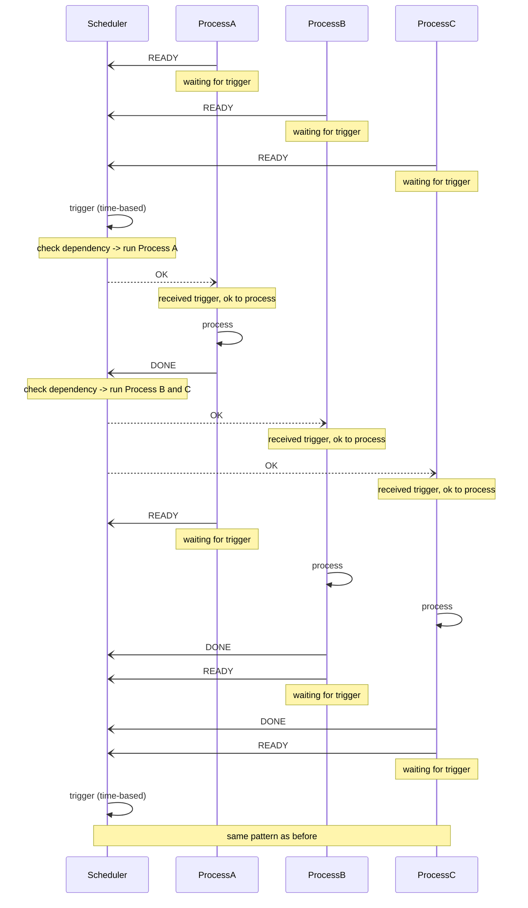

# DPS

DPS: Deterministic Process Scheduler - schedules user processes considering periodic cycles and process dependencies.

## Features

- Periodic process execution with pre-defined dependencies (single, sequential, parallel)
  - example: Image processing using camera frame
- Simple messaging for various implementation languages
  - this repository includes sample client for Rust, Python
- Simulation and Visualization tools (currently under planning)

## Process scheduling

This section describes how DPS schedules your processes using a sequence diagram.

This is a simplified diagram, see also detailed documents for a complete understanding.

### example scenario: A -> B, C

- Process A starts periodically
- Process B and C start when A completes

## Components of this repository

- this repository
  - messages-rs
    - Common message types and structures for Rust server/scheduler and client/process.
  - server-rs
    - Server/Scheduler program implemented in Rust.
  - clientlib-rs
    - Client library for Rust client/process. Handles communication with the server/scheduler.

EOF
