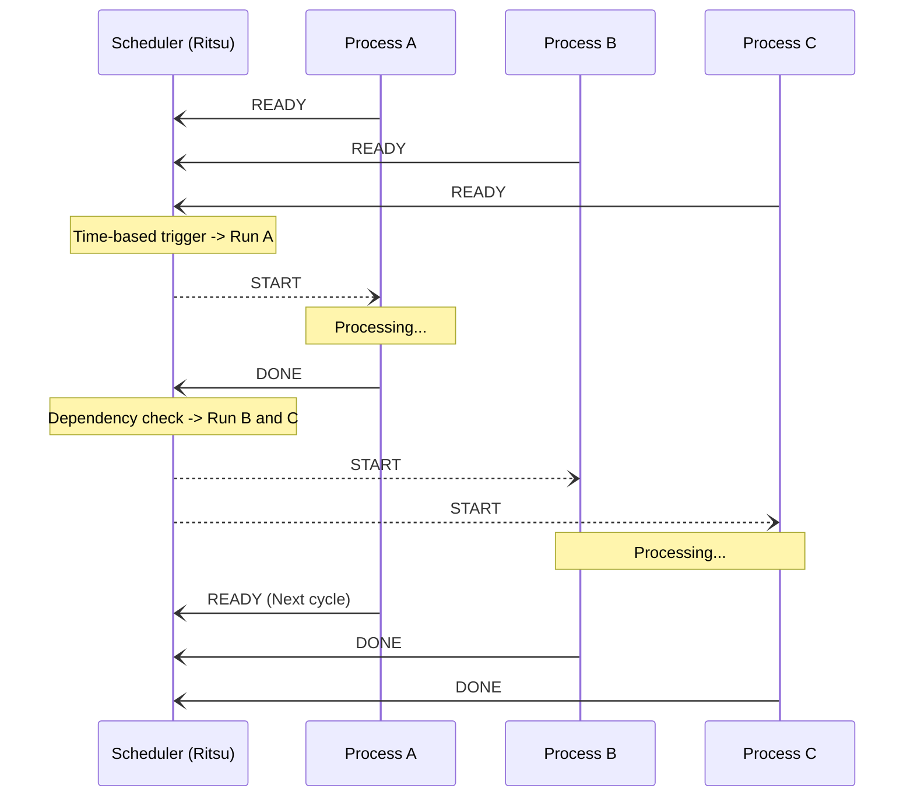

# Ritsu: A Deterministic Process Scheduler

Schedules user processes considering periodic cycles and process dependencies.

## Features

- **Periodic execution**: Predictable execution based on pre-defined timing and cycles.
- **Dependency management**: Flexible scheduling based on process dependencies (sequential and parallel).
  - Example: Image processing pipelines using camera frames.
- **Multi-language support**: Simple messaging protocol supporting multiple programming languages.
  - Modular transport support (UDP-based by default).
  - This repository includes sample clients for **Rust** and **Python**.
- **Simulation and Visualization**: Advanced tools for system planning (currently in development).

## Process Scheduling

This section describes how Ritsu schedules your processes using a sequence diagram.
For more details, please refer to the [detailed documentation](./docs/README.md).

### Example Scenario: A -> (B, C)

- Process A starts periodically.
- Processes B and C start simultaneously once A completes.

## Repository Structure

- **[rt-config-rs](./rt-config-rs)**: Common configuration structures and validation logic shared between the scheduler and visualization tools.
- **[rt-core-rs](./rt-core-rs)**: The core scheduling logic. Manages process states and dependency resolutions.
- **[rt-server-rs](./rt-server-rs)**: The Ritsu scheduler server. Responsible for client management, timing control, and coordinating execution with the core scheduler.
- **[rt-message-rs](./rt-message-rs)**: Common message types and serialization protocol used for server-client communication.
- **[rt-client-rs](./rt-client-rs)**: High-level client library for Rust-based processes.
- **[rt-client-py](./rt-client-py)**: Client implementation for Python-based processes.

## Documentation

Detailed specifications and guides can be found in the [docs](./docs/README.md) directory.
