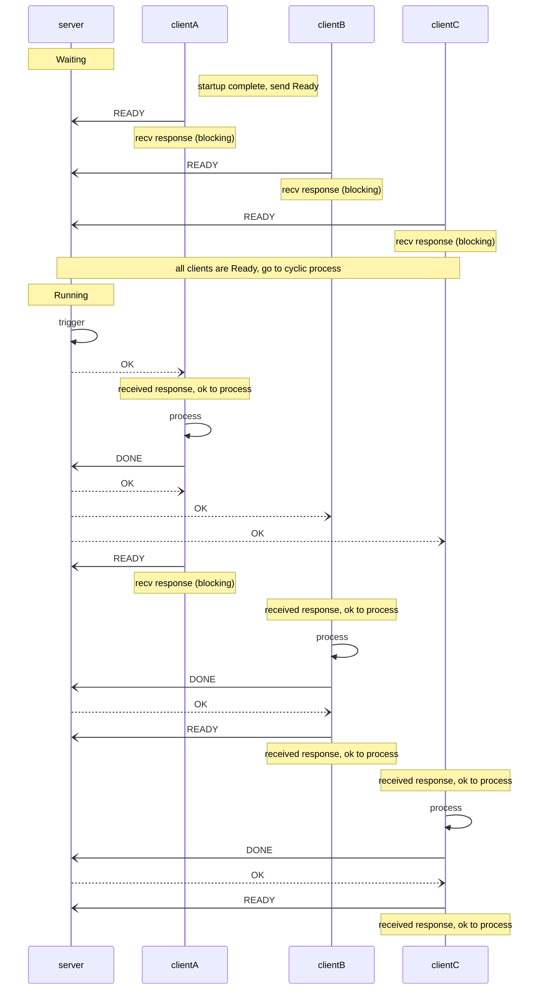

# DPS

DPS: Deterministic Process Scheduler - schedules user processes considering periodic cycles and process dependencies.

## Features

- Periodic process execution with dependency (single, sequential, parallel)
  - example: Image processing using camera frame
- Simple messaging for various implementation languages
  - this repo contains sample client for Rust, Python
- Simulation and Visualization tools (currently under planning)

## Basic Design

This software employs a Client-Server architecture utilizing simple UDP messaging.

The client passively waits for a start trigger from the server.
The server then sends a start trigger based on the periodic cycles and dependencies between the clients.

### Basic Sequence

example: A -> B + C pattern:



### Message format

Massage length is up to 512 bytes.
Message content is a simple String-based format:
```
Message:
  MessageType:ClientID[,Extras]

MessageType:
  -> string of message type (see next section for details)
ClientID:
  -> string of 3-digit decimal with leading zero (e.g. "000" ~ "999")
Extras: *for future use*
  Extra[,Extras]
Extra:
  -> string value
```

### MessageType

REQUEST_MSG: client to server

- "READY"
  - The client notifies the server that it's ready to start the process.
  - The client must wait for a response from the server.
    - The server holds the response until the trigger for this client is ready.
- "DONE"
  - The client notifies the server that the process is completed.
    - The server triggers the next dependent process.
  - After sending "DONE", the client needs to send "READY" to request the next trigger.
- "EXIT"
  - The client notifies the server that it's going to exit.

RESPONSE_MSG: server to client

- "OK"
  - Returned for "READY", "DONE", "EXIT".
  - Indicates that the request was successful.
  - The client can continue processing.
- "SKIP"
  - Returned for "READY".
  - Indicates that the trigger has been canceled.
  - The client needs to send "READY" again to request the next trigger.
- "ERROR"
  - Returned for "READY", "DONE".
  - Indicates that the request is invalid or the server is in an invalid state.
  - The client must send "EXIT" to the server and exit.

## Components of this repository

- this repository
  - messages-rs
    - Common message types and structures for Rust server and clitnt.
  - clientlib-rs
    - Client library implemented in Rust. Handles communication with the server.
  - server-rs
    - Scheduler program.

EOF
