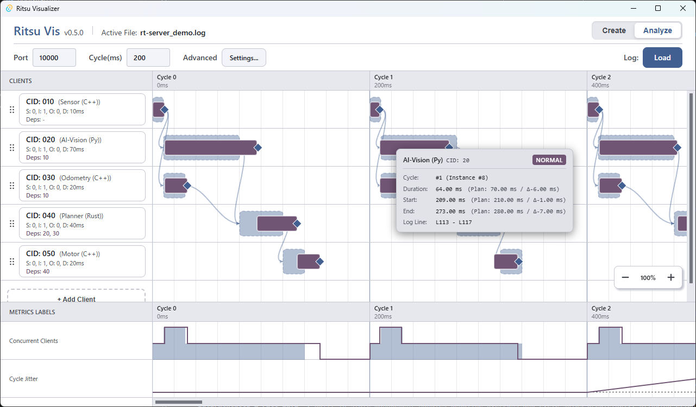
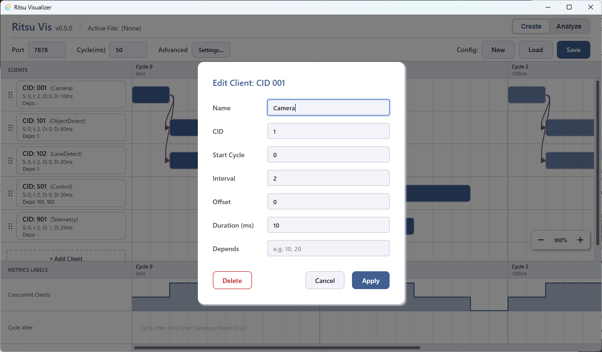
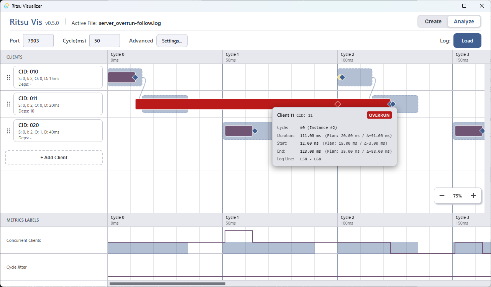
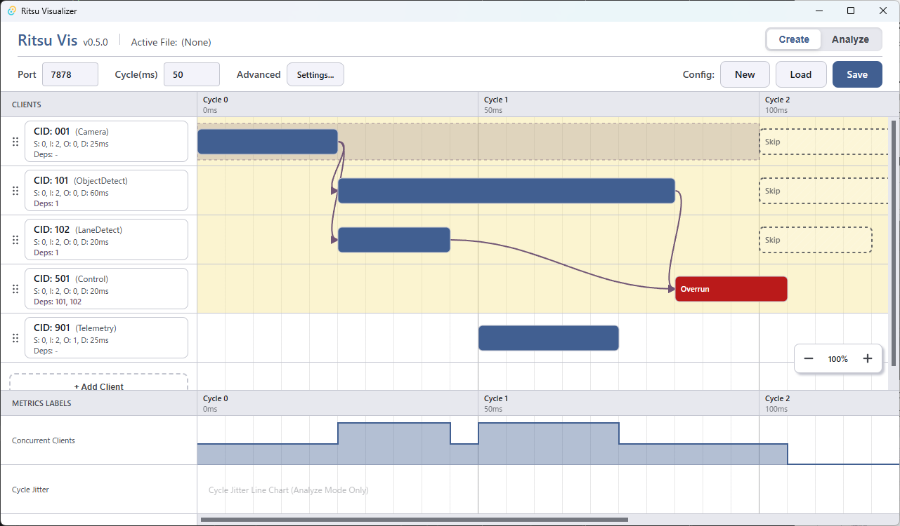
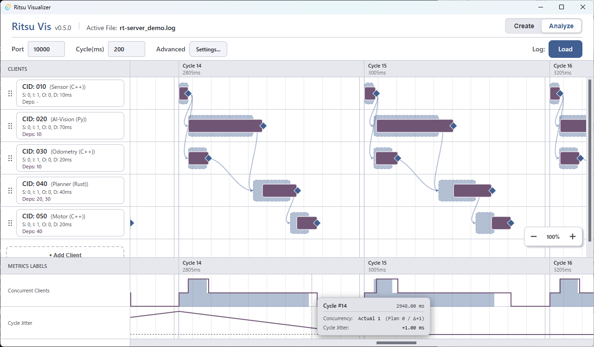
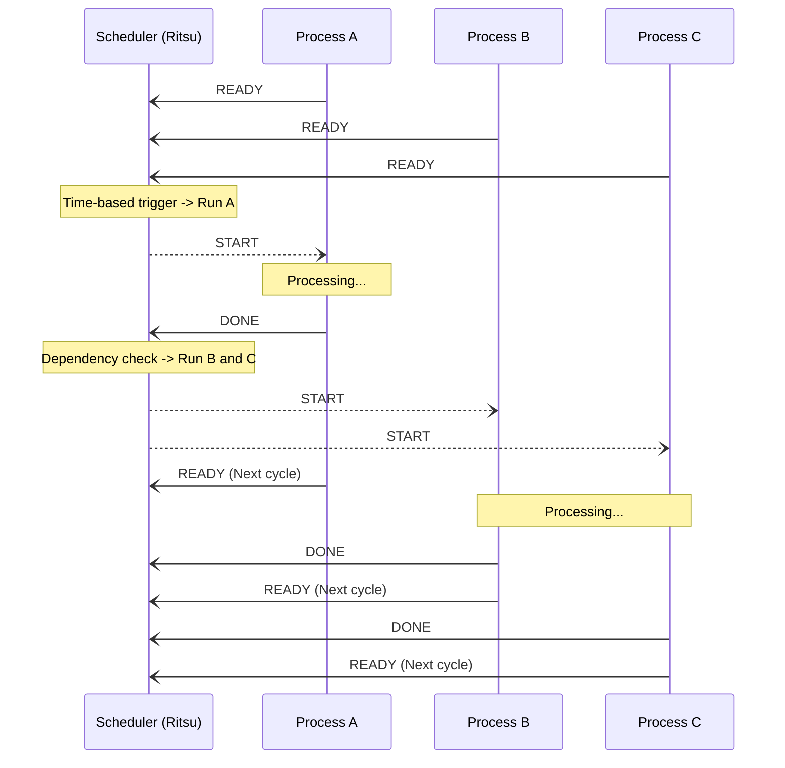

# Ritsu: A Deterministic Process Scheduler

<p align="left">
  
  
  
  
</p>

A lightweight process scheduler that deterministically coordinates multi-process pipelines based on periodic cycles and DAG dependencies.



Note: Ritsu targets predictable, soft real-time coordination and reproducible execution order across processes, not hard real-time execution guarantees.

## Features

- **Periodic Execution**: Predictable execution based on predefined timing and cycles.
- **Dependency Management**: Flexible scheduling based on process dependencies (sequential and parallel).
  - Example: Image processing pipelines using camera frames.
- **Multi-Language Support**: A simple messaging protocol supporting multiple programming languages.
  - Modular transport support (UDP-based by default).
  - This repository includes sample clients for **Rust**, **Python**, and **C/C++**.
- **Simulation & Visualization**: Advanced tools for system planning and scheduling analysis.

**Visualizer Highlights:**

| Create Mode | Analyze Mode |
| :---: | :---: |
| <br />Configure process periods, execution times, and dependencies interactively. | <br />Overlay actual execution logs onto scheduled plans to inspect timing deltas. |
| <br />Interactive drag-and-drop editing immediately highlights deadline overruns and cascading delays. | <br />Track planned vs. actual concurrency to identify system load peaks and execution bottlenecks. |

## Why Ritsu?

Coordinating multi-language pipelines (such as C sensor drivers, Python ML inference, and Rust motion planners) often requires deterministic timing across heterogeneous processes without adding large runtime overhead or relying on fragile ad-hoc timer loops.

Ritsu complements existing systems with a focused, lightweight approach:

- **Minimal Footprint & Easy Integration**: Pure standard-library coordination over modular transports (UDP by default). Works cleanly alongside existing communication middleware, shared memory, or IPC, without imposing heavy dependencies or complex build systems on client processes.
- **Control-Plane Focus**: Ritsu strictly manages process execution timing, DAG dependencies, and lifecycle states—leaving payload data transfer (such as shared memory via [Eclipse iceoryx2](demo/iceoryx2-pipeline/README.md), ROS topics, or custom IPC) decoupled and flexible.
- **Deterministic & Fail-Safe**: Built-in state management handles deadline overruns and cycle skips predictably, allowing clients to transition safely into fail-safe states.
- **Simulation & Verification First**: Design and inspect schedules visually using `rt-vis` before deploying to real hardware, and verify actual execution logs against your planned timeline.

## Quickstart

Experience Ritsu's deterministic scheduling through self-contained reference demos. Each demo isolates its own build artifacts and dependencies, and runs with a single script.

### Available Demos

| Demo | Focus | Stack |
| :--- | :--- | :--- |
| **[robot-pipeline](demo/robot-pipeline/README.md)** | 5 Hz **Fork-Join DAG** coordination (zero external dependencies) | C, Python, Rust |
| **[iceoryx2-pipeline](demo/iceoryx2-pipeline/README.md)** | 10 Hz **Control + Data Plane** integration with fallback, `SKIP` recovery, and `E-STOP` | Rust, Python, [Eclipse iceoryx2](https://iceoryx.io/) ([GitHub](https://github.com/eclipse-iceoryx/iceoryx2)) |

**Prerequisites:** Rust (>= 1.85) and Python (>= 3.12) for all demos, plus a C/C++ compiler with CMake (>= 3.14) for C-based demos (`robot-pipeline`). See each demo's README for OS-specific setup (e.g., `venv` on Linux).

### Run & Inspect

1. **Run a demo** (automatically builds and launches `rt-server` and all client nodes in dedicated console windows):
   - **Windows (PowerShell):**
     ```powershell
     # e.g., demo/robot-pipeline or demo/iceoryx2-pipeline
     cd demo/robot-pipeline
     .\run_demo.ps1
     ```
   - **Linux / macOS (Bash):**
     ```bash
     # e.g., demo/robot-pipeline or demo/iceoryx2-pipeline
     cd demo/robot-pipeline
     ./run_demo.sh
     ```

2. **Inspect with the visualizer (`rt-vis`)**:  
   Launch `rt-vis` and open `demo/<demo-name>/logs/rt-server.log` in **Analyze** mode to inspect scheduled vs. actual timelines, safety slack margins, and `SKIP` behavior:
   - **Pre-built binary (Windows):** Download the latest release from [GitHub Releases](https://github.com/nao-kawano/ritsu-scheduler/releases) and run `rt-vis.exe`.
   - **From source (Windows / Linux / macOS, requires Node.js >= 18):**
     ```bash
     # Install frontend dependencies (first time only)
     npm --prefix rt-vis-rs install

     # Launch visualizer in development mode
     npm --prefix rt-vis-rs run tauri dev
     ```

Refer to each demo's guide in the table above for architecture diagrams, OS-specific prerequisites, and cycle-by-cycle scenario details.

## Process Scheduling

The sequence diagram below illustrates how Ritsu schedules processes.
For more details, see the [documentation](./docs/README.md).

### Example Scenario: A -> (B, C)

- Process A starts periodically.
- Processes B and C start simultaneously once A completes.


```mermaid
sequenceDiagram
  participant S as Scheduler (Ritsu)
  participant A as Process A
  participant B as Process B
  participant C as Process C

  A -) S: READY
  B -) S: READY
  C -) S: READY

  Note over S: Time-based trigger -> Run A
  S --) A: START
  Note over A: Processing...
  A -) S: DONE

  Note over S: Dependency check -> Run B and C
  S --) B: START
  S --) C: START
  A -) S: READY (Next cycle)
  Note over B,C: Processing...

  B -) S: DONE
  B -) S: READY (Next cycle)
  C -) S: DONE
  C -) S: READY (Next cycle)
```

## Repository Structure

- **[rt-config-rs](./rt-config-rs)**: Common configuration structures and validation logic shared between the scheduler and visualization tools.
- **[rt-core-rs](./rt-core-rs)**: The core scheduling logic. Manages process states and dependency resolution.
- **[rt-server-rs](./rt-server-rs)**: The Ritsu scheduler server. Responsible for client management, timing control, and coordinating execution with the core scheduler.
- **[rt-message-rs](./rt-message-rs)**: Common message types and serialization protocol used for server-client communication.
- **[rt-client-rs](./rt-client-rs)**: Client library for Rust.
- **[rt-client-py](./rt-client-py)**: Client library for Python.
- **[rt-client-c](./rt-client-c)**: Client library for C/C++.
- **[rt-vis-rs](./rt-vis-rs)**: Tauri-based visualizer application for process scheduling simulation and configuration editing.
- **[demo](./demo)**: Reference demos showcasing multi-language DAG orchestration and external data-plane integration.

## Documentation

See the [docs](./docs/README.md) directory for detailed specifications and guides.

## License

This project is licensed under the Apache License, Version 2.0. See the [LICENSE](LICENSE) file for details.
