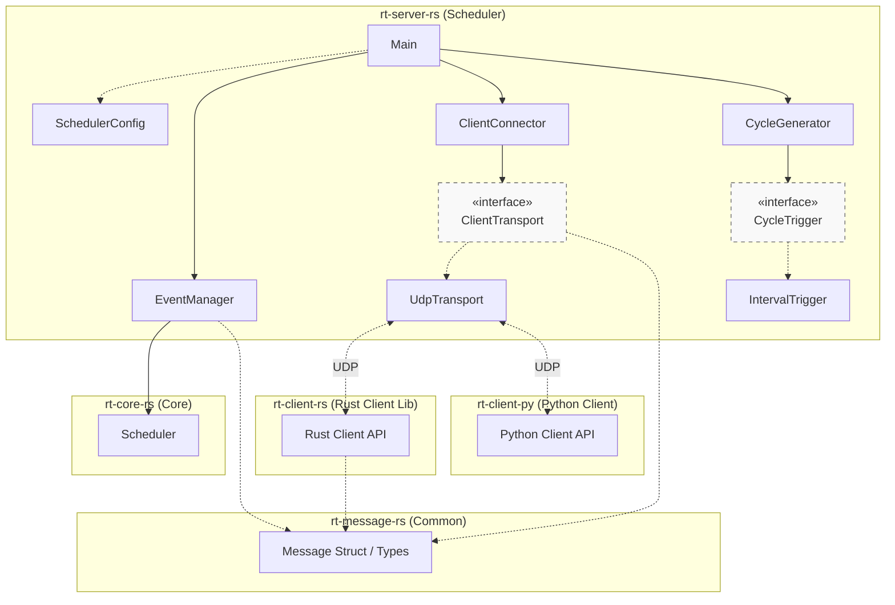

# Documentation

### Structural Diagram

The following diagram shows the structural relationships and ownership between the components.

## Basic Design and Specs

- [Process Configuration](./configuration.md)
  - Configuration for process dependencies and timing.
- [Message Sequence](./message-sequence.md)
  - Basic message flow between clients and server.
- [Message Sequence of SKIP scenario](./message-sequence-skip.md)
  - Advanced message flow for Deadline Exceeded.
- [Message Format](./message-format.md)
  - Messages format exchanged between clients and server.
- [State Management](./state-management.md)
  - State management in the client and server.

## Design Studies & Internal Resources

- [Logging Guidelines](./logging.md)
  - Standards for logs and visualization support.
- [Design Study for UDP Packet Loss](./study_udp-packet-loss.md)
  - Detailed analysis and expected behavior for packet loss scenarios.

EOF
