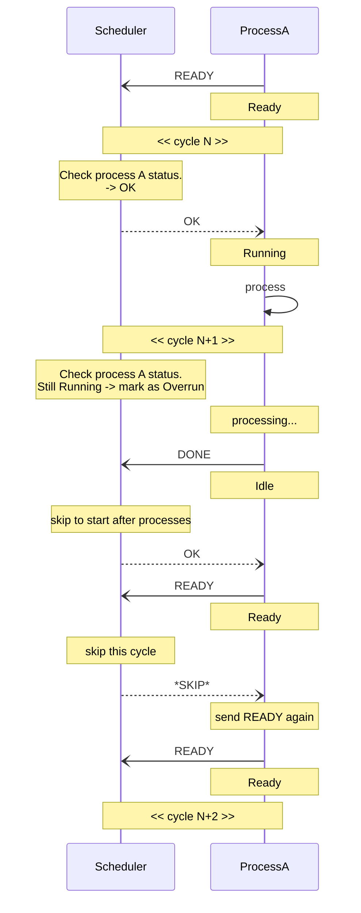

# Message Sequence of SKIP scenario

Each process has an execution cycle and dependencies.  
The scheduler attempts to maintain these cycles and dependencies as much as possible using SKIP message.

At the start of each cycle, verify that the process and its dependent processes are in the Ready state.

- If the process is not in Ready state, respond with SKIP.
  - If the process is still Running, mark it as Overrun.
    - Upon completion, cancel the execution of dependent processes and respond with SKIP.
- If the process has forward dependent processes, response with SKIP following the same rules as above.

## Examples

- Single client A without dependency

```mermaid
gantt
  todayMarker off
  dateFormat m
  axisFormat %M
  tickInterval 1minute

  section OK
    A-cycle0: a0, 0, 0.75m
    A-Done: milestone, a0d, after a0,
    A-Ready: milestone, a1r, after a0, 0.25m
    A-cycle1: a1, 1, 0.50m
    A-Done: milestone, a1d, after a1,
    A-Ready: milestone, a2r, after a1, 0.25m
    A-cycle2: a2, 2, 0.75m
    A-Done: milestone, a2d, after a2,
    A-Ready: milestone, a3r, after a2, 0.25m

  section SKIP
    A-cycle0: crit, aa0, 0, 1.25m
    A-Done: milestone, aa0d, after aa0,
    A-Ready=SKIP: milestone, aa1r, after aa0, 0.25m
    A-Ready: milestone, aa2r, after aa1r,
    A-cycle2: aa2, 2, 0.75m
    A-Done: milestone, aa2d, after aa2,
    A-Ready: milestone, a3r, after aa2, 0.25m
```

- Client B depends on client A

```mermaid
gantt
  todayMarker off
  dateFormat m
  axisFormat %M
  tickInterval 1minute

  section OK
    A-cycle0: a0, 0, 0.5m
    A-Done: milestone, a0d, after a0,
    A-Ready: milestone, a1r, after a0, 0.25m
    A-cycle1: a1, 1, 0.5m
    A-Done: milestone, a1d, after a1,
    A-Ready: milestone, a2r, after a1, 0.25m
    A-cycle2: a2, 2, 0.5m
    A-Done: milestone, a2d, after a2,
    A-Ready: milestone, a3r, after a2, 0.25m

    B-cycle0: b0, after a0, 0.25m
    B-Done: milestone, b0d, after b0,
    B-Ready: milestone, b1r, after b0, 0.25m
    B-cycle1: b1, after a1, 0.25m
    B-Done: milestone, b1d, after b1,
    B-Ready: milestone, b2r, after b1, 0.25m
    B-cycle2: b2, after a2, 0.25m
    B-Done: milestone, b2d, after b2,
    B-Ready: milestone, b3r, after b2, 0.25m

  section NG1
    A-cycle0: crit, aa0, 0, 1.25m
    A-Done: milestone, aa0d, after aa0,
    A-Ready=SKIP: milestone, aa1r, after aa0, 0.25m
    A-Ready: milestone, aa2r, after aa1r,
    A-cycle2: aa2, 2, 0.5m
    A-Done: milestone, aa2d, after a2,
    A-Ready: milestone, aa3r, after a2, 0.25m

    B-SKIP: milestone, bb0r, 1,
    B-Ready=SKIP: milestone, bb1r, after bb0r, 0.25m
    B-Ready: milestone, bb2r, after bb1r,
    B-cycle2: bb2, after aa2, 0.25m
    B-Done: milestone, bb2d, after bb2,
    B-Ready: milestone, bb3r, after bb2, 0.25m

  section NG2
    A-cycle0: aaa0, 0, 0.5m
    A-Done: milestone, aaa0d, after aaa0,
    A-Ready: milestone, aaa1r, after aaa0, 0.25m
    A-Skip: milestone, aaa1s, 1,
    A-Ready: milestone, aaa2r, after aaa1s, 0.25m
    A-cycle2: aaa2, 2, 0.5m
    A-Done: milestone, aaa2d, after aaa2,
    A-Ready: milestone, aaa3r, after aaa2, 0.25m

    B-cycle0: crit, bbb0, after aaa0, 0.75m
    B-Done: milestone, bbb0d, after bbb0,
    B-Ready=SKIP: milestone, bbb1r, after bbb0, 0.25m
    B-Ready: milestone, bbb2r, after bbb1r,
    B-cycle2: bbb2, after aaa2, 0.25m
    B-Done: milestone, bbb2d, after bbb2,
    B-Ready: milestone, bbb3r, after bbb2, 0.25m
```

EOF
