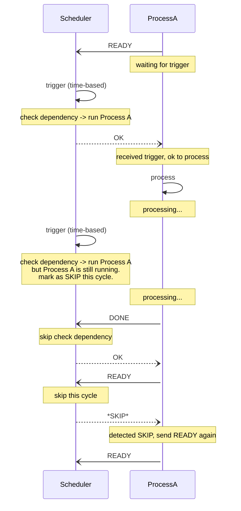
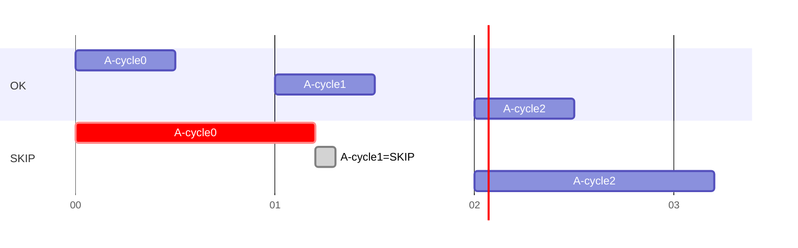
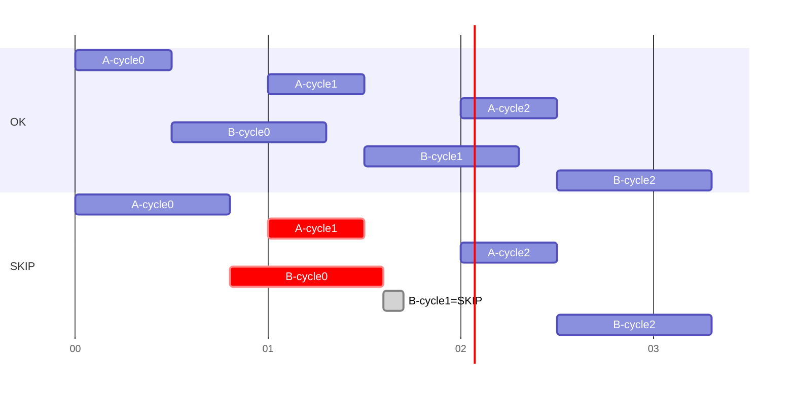

# Message Sequence of SKIP scenario

When a trigger occurs and the client is still processing, the server sends a SKIP response to the READY.
This tells the client to skip its current execution and retry to adjust next timing.

## Examples

- Single client A without dependency

- Client B depends on client A

EOF
