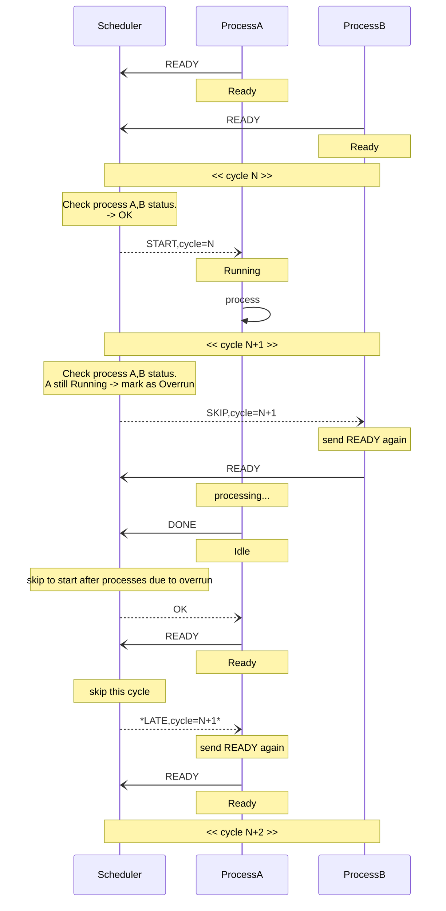

# Message Sequence of SKIP scenario

Each process has an execution cycle and dependencies.  
The scheduler attempts to maintain these cycles and dependencies as much as possible using SKIP and LATE message.

At the start of each cycle, verify that the process and its dependent processes are in the Ready state.

- **Process Not Ready (LATE)**
  - If the process is not in the `Ready` state by the start of the current cycle,
    the scheduler responds with `LATE` to the eventual `READY` request.
  - This instructs the client to send `READY` again to wait for the next cycle.

- **Process Overrun**
  - If the process is still running at the start of the new cycle, it is marked as `Overrun`.
  - Upon completion, the scheduler skips triggering any dependent processes.
  - The subsequent `READY` request is treated as **Process Not Ready**, and the scheduler responds with `LATE`.

- **Dependency Not Met (SKIP)**
  - If the process is `Ready` for the current cycle, but any of its dependent processes are not ready
    (e.g., skipped or overrun), the scheduler responds with `SKIP`.
  - This notifies the client to skip the current execution and send `READY` again for the next cycle.

Example: ProcessA->ProcessB scenario

## Examples

- Single client A without dependency

```mermaid
gantt
  todayMarker off
  dateFormat m
  axisFormat %M
  tickInterval 1minute

  section OK
    A-cycle0: a0, 0, 0.75m
    A-Done=OK: milestone, a0d, after a0,
    A-Ready: milestone, a1r, after a0d, 0.2m
    A-cycle1: a1, 1, 0.50m
    A-Done=OK: milestone, a1d, after a1,
    A-Ready: milestone, a2r, after a1d, 0.2m
    A-cycle2: a2, 2, 0.75m
    A-Done=OK: milestone, a2d, after a2,
    A-Ready: milestone, a3r, after a2d, 0.2m

  section SKIP
    A-cycle0: crit, aa0, 0, 1.25m
    A-Done=OK: milestone, aa0d, after aa0,
    A-Ready=LATE: milestone, aa1r, after aa0d, 0.2m
    A-Ready: milestone, aa2r, after aa1r,
    A-cycle2: aa2, 2, 0.75m
    A-Done: milestone, aa2d, after aa2,
    A-Ready: milestone, a3r, after aa2d, 0.2m
```

- Client B depends on client A

```mermaid
gantt
  todayMarker off
  dateFormat m
  axisFormat %M
  tickInterval 1minute

  section OK
    A-cycle0: a0, 0, 0.5m
    A-Done=OK: milestone, a0d, after a0,
    A-Ready: milestone, a1r, after a0d, 0.2m
    A-cycle1: a1, 1, 0.5m
    A-Done=OK: milestone, a1d, after a1,
    A-Ready: milestone, a2r, after a1d, 0.2m
    A-cycle2: a2, 2, 0.5m
    A-Done=OK: milestone, a2d, after a2,
    A-Ready: milestone, a3r, after a2d, 0.2m

    B-cycle0: b0, after a0d, 0.2m
    B-Done=OK: milestone, b0d, after b0,
    B-Ready: milestone, b1r, after b0d, 0.2m
    B-cycle1: b1, after a1d, 0.25m
    B-Done=OK: milestone, b1d, after b1,
    B-Ready: milestone, b2r, after b1d, 0.2m
    B-cycle2: b2, after a2d, 0.25m
    B-Done=OK: milestone, b2d, after b2,
    B-Ready: milestone, b3r, after b2d, 0.2m

  section NG1
    A-cycle0: crit, aa0, 0, 1.25m
    A-Done=OK: milestone, aa0d, after aa0,
    A-Ready=LATE: milestone, aa1r, after aa0d, 0.2m
    A-Ready: milestone, aa2r, after aa1r,
    A-cycle2: aa2, 2, 0.5m
    A-Done=OK: milestone, aa2d, after aa2,
    A-Ready: milestone, aa3r, after aa2d, 0.2m

    B-SKIP: milestone, bb0s, 1,
    B-Ready: milestone, bb1r, after bb0s, 0.2m
    B-cycle2: bb2, after aa2d, 0.2m
    B-Done=OK: milestone, bb2d, after bb2,
    B-Ready: milestone, bb3r, after bb2d, 0.2m

  section NG2
    A-cycle0: aaa0, 0, 0.5m
    A-Done=OK: milestone, aaa0d, after aaa0,
    A-Ready: milestone, aaa1r, after aaa0, 0.2m
    A-Skip: milestone, aaa1s, 1,
    A-Ready: milestone, aaa2r, after aaa1s, 0.2m
    A-cycle2: aaa2, 2, 0.5m
    A-Done=OK: milestone, aaa2d, after aaa2,
    A-Ready: milestone, aaa3r, after aaa2d, 0.2m

    B-cycle0: crit, bbb0, after aaa0d, 0.75m
    B-Done=OK: milestone, bbb0d, after bbb0,
    B-Ready=LATE: milestone, bbb1r, after bbb0d, 0.2m
    B-Ready: milestone, bbb2r, after bbb1r,
    B-cycle2: bbb2, after aaa2d, 0.2m
    B-Done=OK: milestone, bbb2d, after bbb2,
    B-Ready: milestone, bbb3r, after bbb2d, 0.2m
```

EOF
