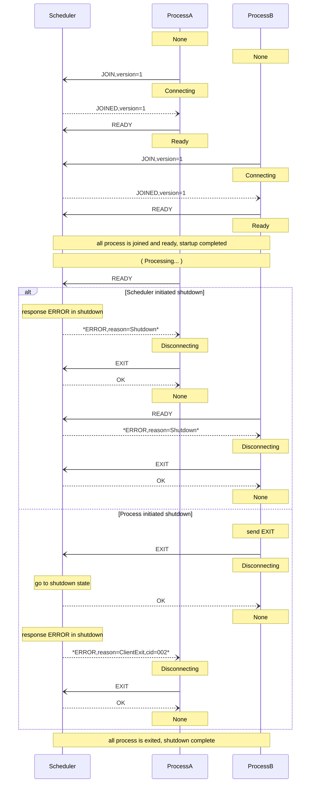
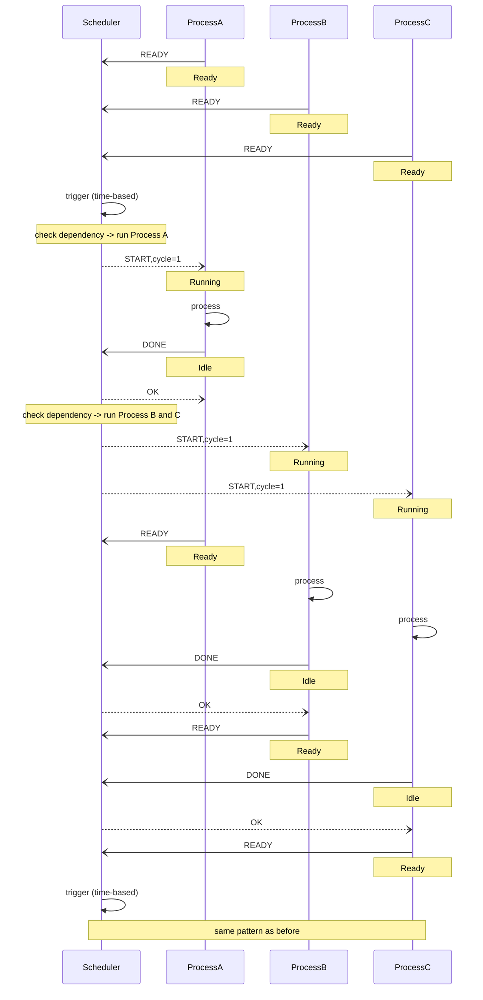

# Message Sequence

This software employs a Client-Server architecture utilizing simple UDP messaging.

The client passively waits for a start trigger from the server.
The server then sends a start trigger based on the periodic cycles and dependencies between the clients.

## Startup and Shutdown

The client starts by sending a "JOIN" and "READY" message to the server.

## Basic Scheduling

- Process A starts periodically
- Process B and C start when A completes

EOF
