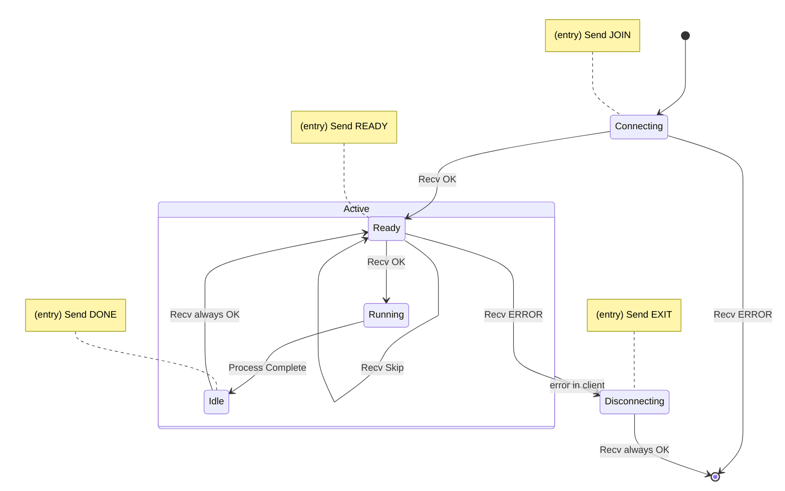
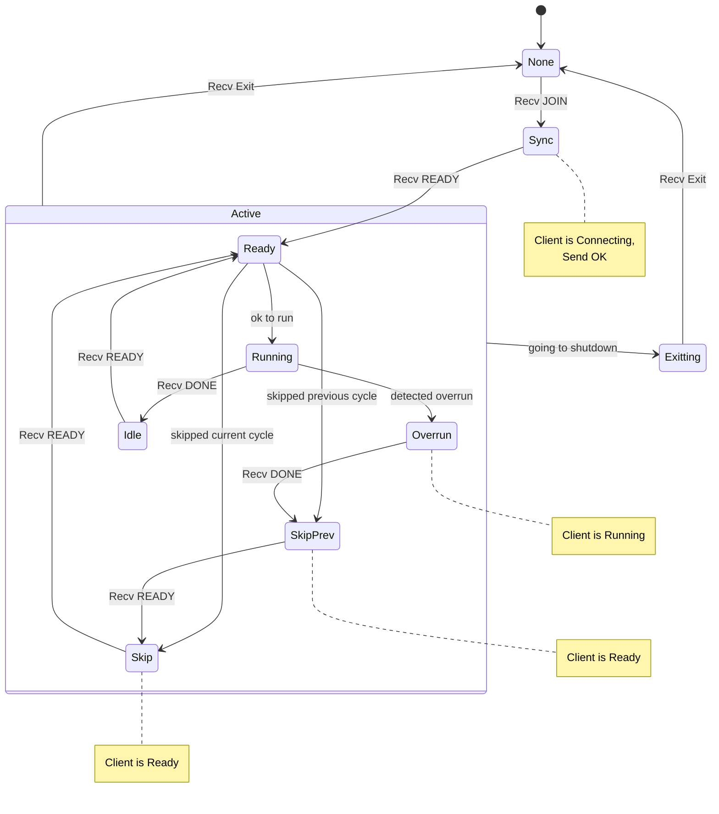

# State Management

## Client Side

```mermaid
stateDiagram-v2
    [*] --> Connecting
    note left of Connecting : (entry) Send JOIN
    Connecting --> Ready : Recv OK
    Connecting --> [*] : Recv ERROR

    State Active {
        note left of Ready : (entry) Send READY
        Ready --> Running : Recv OK
        Ready --> Ready : Recv Skip

        Running --> Idle : Process Complete
        note left of Idle : (entry) Send DONE

        Idle --> Ready : Recv always OK
    }

    Ready --> Disconnecting : Recv ERROR
    Active --> Disconnecting : error in client
    note left of Disconnecting : (entry) Send EXIT

    Disconnecting --> [*] : Recv always OK
```

## Server Side

```mermaid
stateDiagram-v2
    [*] --> None
    None --> Sync : Recv JOIN
    Sync --> Ready : Recv READY
    Active --> None : Recv Exit
    Active --> Exitting : going to shutdown
    Exitting --> None : Recv Exit

    Note right of Sync : Client is Connecting,<br />Send OK

    State Active {
        Ready --> Skip : skipped current cycle
        Ready --> SkipPrev : skipped previous cycle
        Ready --> Running : ok to run
        Skip --> Ready : Recv READY
        SkipPrev --> Skip : Recv READY

        Running --> Overrun : detected overrun
        Overrun --> SkipPrev : Recv DONE

        Running --> Idle : Recv DONE

        Idle --> Ready : Recv READY

        note right of Skip : Client is Ready
        note right of SkipPrev : Client is Ready
        note right of Overrun : Client is Running
    }
```
