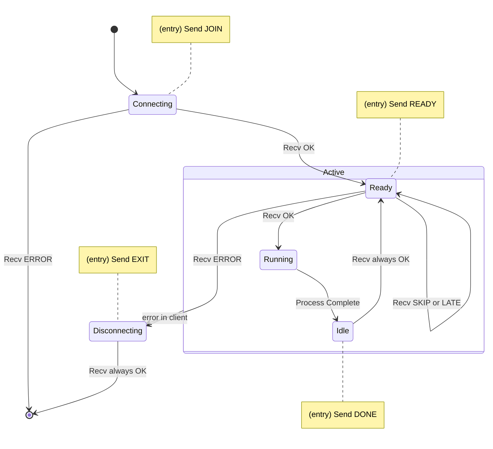
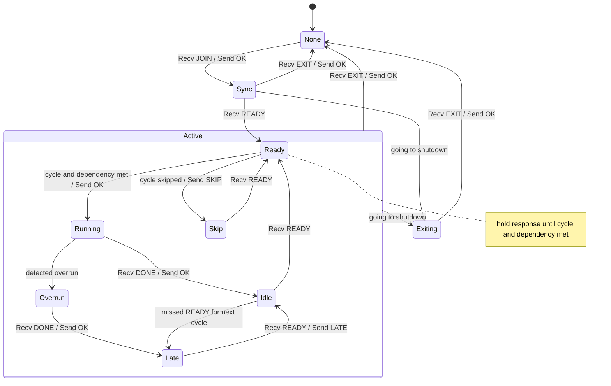

# State Management

This document describes state management of DPS, which manages multiple clients and
controls the execution of each client.

Understanding both client-side and server-side state management is
essential for developing and maintaining DPS effectively.

## Client Side

This section details the state management on the client-side,
illustrating the process flow that each client should implement.

## Server Side

This section explains how the server manages the states of each client internally.

Understanding the server-side state management is critical for ensuring proper coordination and
control of client processes.

Note:

- None
  - Client is Disconnected.
  - Server is waiting for `JOIN`.
- Sync
  - Client is Connecting.
  - Server is waiting for `READY`.
- Ready
  - Client is Ready.
  - Server holds the response until the target cycle starts and all dependencies are met.
- Running
  - Client is Running.
  - Server is waiting for `DONE`.
- Idle
  - Client is Idle.
  - Server is waiting for `READY`.
- Overrun
  - Client is Running.
  - Server detected an overrun and is waiting for `DONE`.
    - An overrun occurs when the previous execution has not completed by the start of the next cycle.
- Skip
  - Client is Idle.
  - Server skips the run for the current cycle. The Server sends `SKIP` to the client and waits for `READY` again.
  - This happens when:
    - Client is in Ready but dependent process is not completed for previous cycle.
    - Client is still waiting for dependencies to be met in previous cycle.
- Late
  - Client is Idle.
  - Server skips the run for the current cycle. It waits for `READY` and responds with `LATE`.
  - This happens when:
    - The server has not received `READY` by the start of the current cycle and keeps waiting for `READY`.
    - The server detected that an overrun process is complete and is waiting for `READY`.
- Exiting
  - Client is Disconnecting.
  - Server is waiting for `EXIT`.

EOF
